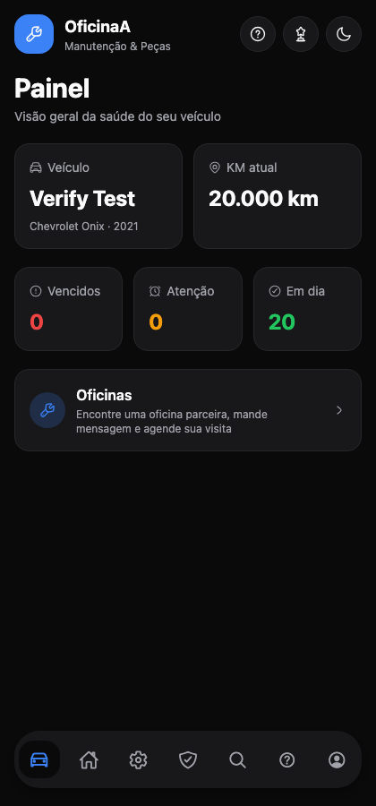
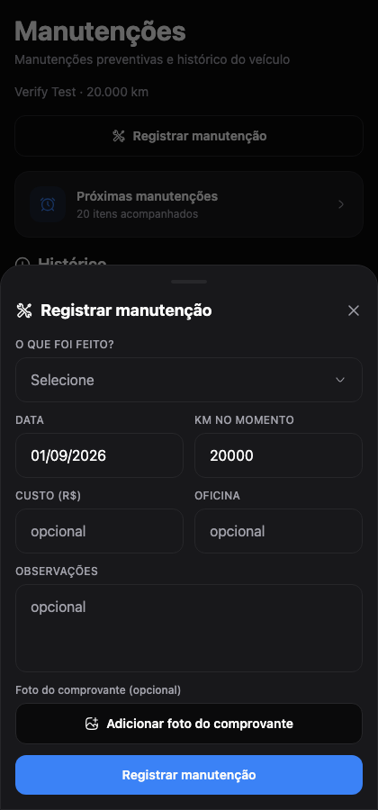

<h1 align="center">🚗 Deluxe Car</h1>

  App para quem quer cuidar do carro sem planilha: garagem, manutenções, lembretes, oficinas e uma comunidade de donos de veículos — tudo num lugar só.

  
  
  
  
  

  
  &nbsp;&nbsp;
  

> 🔒 **O código-fonte é privado.** Este repositório apresenta o projeto. Se você é recrutador(a) ou empresa e quer ver o código, entre em contato — posso mostrar numa conversa ou liberar acesso temporário.

---

## ✨ Funcionalidades

### Garagem e manutenção
- **Garagem** com vários veículos, fotos, especificações técnicas e documentos
- **Painel** com a saúde do veículo: itens vencidos, em atenção e em dia, com base na quilometragem
- **Histórico de manutenção** com custo, oficina, observações e foto do comprovante
- **Lembretes** com notificações push (calibrar pneus, nível do óleo, fluido de freio, etc.)
- **Passaporte do Veículo**: exporta todo o histórico do carro em PDF — útil na hora de vender
- **Manual e diagnóstico** de problemas comuns por marca

### Oficinas
- Busca de oficinas parceiras
- Agendamento de visitas e acompanhamento em "Meus agendamentos"
- Chat direto com a oficina
- **App separado para o dono da oficina**, usando o mesmo backend — o que um cliente agenda aparece para a oficina

### Comunidade
- Feed com posts, curtidas, comentários e itens salvos
- Perfis públicos, seguidores e mensagens diretas
- Grupos com chat, convites e compartilhamento de localização
- Central de notificações

### Engajamento
- Conquistas, badges e sequências (streaks) de cuidado com o veículo
- Tutorial guiado de primeiro uso
- Tema escuro

## 🛠️ Tecnologias

| Camada | Stack |
| --- | --- |
| App | React Native, Expo (SDK 57), Expo Router, TypeScript |
| Estilo | NativeWind (Tailwind CSS), Hugeicons |
| Backend | Supabase — PostgreSQL, Auth e Storage |
| Recursos nativos | Notificações, localização, câmera/galeria, geração de PDF |
| Plataformas | iOS, Android e Web |

## 🧠 Destaques técnicos

- **Banco de dados com 24 tabelas** modeladas em PostgreSQL (veículos, manutenções, comunidade, grupos, oficinas, agendamentos...)
- **Segurança com Row Level Security** em todas as tabelas (92 políticas) — cada usuário só lê e altera os próprios dados, direto no banco
- **Dois apps, um backend**: app do cliente e app da oficina compartilham o mesmo Supabase
- **Código organizado por camadas**: telas (rotas por arquivo com Expo Router), componentes por funcionalidade, regras de negócio e acesso a dados separados em `lib/`, tipos em TypeScript
- **Multiplataforma** a partir de um único código: iOS, Android e Web

## 👤 Autor

Feito por **Matheus Machado**.

© 2026 Matheus Machado. Todos os direitos reservados.
